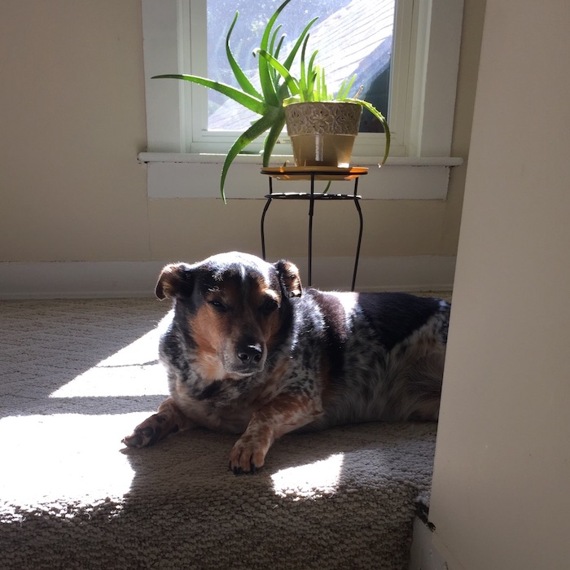

# Dogwalker Checker

Every weekday a very nice person comes by my apartment to take my dog, Patches, out for a walk. Here's a picture of Patches catching some rays ~~

He's a Good Boy.

The walker is scheduled to come between 11a and 4p. The walking service has a website that tells me whether he's been walked but not at what time. I built a scraper which saves the state of the website throughout the day, and I can check that database to see at what time the walker took my Good Boy out for a stroll.

This is an app that lets me check the state of the day's walk and see the distribution of walks past. I built it out using flask and deployed on heroku.

## todo

1. cache mainpage sql query (not needed for each request as it only updates 1x a day).
2. Compute most likely distribution and overlay.
3. Break down distributions from each walker.
4. Database schema endpoint
